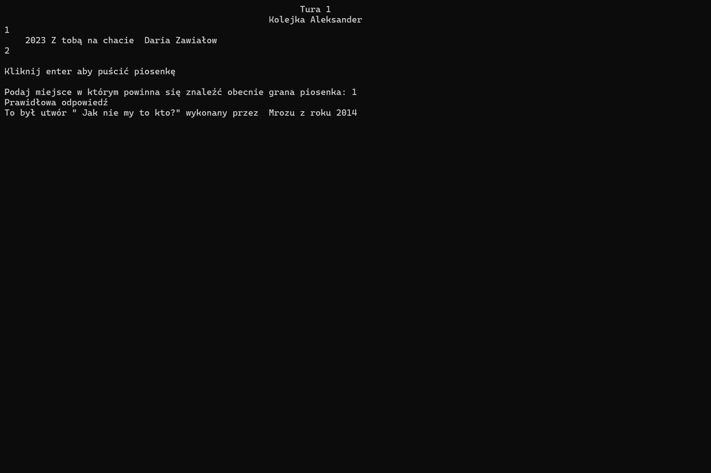

# Hitster

Hitster is a personal project designed to showcase the fundamentals of **Python** programming and **Spotify API** integration. This project demonstrates the creation of a music-based game where players guess the correct timeline of songs, featuring two versions: a **Command-Line Interface (CLI)** and a **Graphical User Interface (GUI)**.

---

## 🚀 Features

- **Spotify Integration**: Fetches song data and plays tracks directly from Spotify.
- **Two Game Modes**: Play using a CLI or an interactive GUI.
- **Dynamic Gameplay**: Randomized song selection ensures unique experiences every time.
- **Multiplayer Support**: Allows multiple players to compete in guessing the correct song timeline.
- **Customizable Settings**: Easily adjust the number of songs required to win.
- **Personal Playlist Support**: Easily add your own Spotify playlists to customize the game experience.

---

## 📂 Project Structure

Hitster/
│
├── CLI_game.py # Command-line version of the game
├── GUI_game.py # Graphical version of the game
├── GUI_CSS.py # Styling for the GUI
├── game_functions.py # Core game logic and functions
├── song_player.py # Handles Spotify playback
├── song_randomizer.py # Randomizes song selection
├── database_updater.py # Updates the song database using Spotify API
├── internet_test.py # Tests internet connectivity and Spotify API
├── spotify_credentials.py # Spotify API credentials and settings
├── MusicFiles/ # Contains song data files
│ └── dane.txt
│
├── screenshots/ # Screenshots of the game
├── README.md # Project documentation
├── LICENSE # License file
└── .gitignore # Git ignore file

---

## 🛠️ Technologies Used

- **Python**: Core programming language for the project.
- **Spotipy**: Python library for Spotify Web API integration.
- **Tkinter**: For creating the graphical user interface.
- **Spotify API**: For fetching song data and playback.
- **Random**: For randomizing song selection.

---

## 🌟 Key Functionalities

1. **CLI Mode**:

   - Players take turns guessing the correct position of songs in their timeline.
   - Songs are played directly from Spotify.

2. **GUI Mode**:

   - Interactive interface with buttons and labels for a seamless experience.
   - Dynamic song playback and timeline updates.

3. **Database Management**:

   - Fetches and updates song data from Spotify playlists.
   - Stores song information in text files for offline use.

4. **Multiplayer Gameplay**:
   - Supports multiple players with individual timelines.
   - Tracks progress and determines the winner.

---

## 📸 Screenshots

### Command Line Version

#### Welcome Page


#### Adding Players


#### Round View


#### Correct Answer



### Graphical Interface Version

#### Welcome Page


#### Adding Players


#### Adding Players 2


#### Round View


#### Correct Answer


---

## ⚙️ Installation and Usage

1. Clone the repository:
   ```bash
    git clone https://github.com/PyRealm/Hitster
   ```
2. Install the required Python libraries:
   ```bash
    pip install spotipy
   ```
3. Open Spotify App
4. Add your Spotify API credentials in spotify_credentials.py.
5. Run the game:
   ```bash
    python GUI_game.py
   ```

### Optionals:

6. To test if everything is working run:
   ```bash
    python internet_test.py
   ```
7. To update the database for the playlist of your choice:
   7.1. Change playlist_id in spotify_credentials.py
   7.2. Run file:
   ```bash
    python database_updater.py
   ```
8. To run the game in Command Line Version run:
   ```bash
    python CLI_game.py
   ```
9. To change the number of songs needed to win go to spotify_credentials.py and change "number_of_songs_to_win" variable
10. To change file from which the songs are played go to spotify_credentials.py and change "writing_path" variable

---

## 🤝 Contributing

Contributions are welcome! If you have suggestions or improvements, feel free to fork the repository and submit a pull request.

---

## 📜 License

This project is under the MIT License - see the [LICENSE](./LICENSE) file for details.
